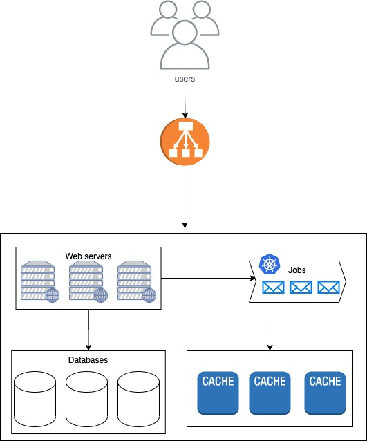

# User Segmentation System

## Introduction

One solution to this problem would be to implement an expiration mechanism in the ES. Each time ES receives a new pair
from USS, it would store it with a timestamp indicating when it will expire (i.e. after two weeks). ES can periodically
check for expired pairs and remove them from its storage. To answer the query, ES can maintain a count of the number of
active users for each segment by incrementing the count when a new pair arrives and decrementing it when a pair expires.
This way, ES will always have up-to-date information on the number of active users for each segment.

## Architecture

The architecture of this system is composed of several components:

- Redis: used as a cache to store the number of users in each segment.
- Endpoints:
    - Endpoint for archiving expired data: this endpoint is used to remove the expired data from the cache. A job in
      Kubernetes is defined to call this endpoint periodically.
    - Endpoint for updating cache: this endpoint is used to update the number of users in each segment in the cache. A
      job in Kubernetes is defined to call this endpoint periodically.
    - Endpoint for retrieving user count in a specific segment: this endpoint is used to retrieve the number of users in
      a specific segment from the cache or postgres.
    - Endpoint for storing new pairs of user and segment: this endpoint is used to store the new pairs of user and
      segment in the cache and postgres.
- Load Balancer
- Postgres
- Kubernetes: to handle deployment and periodic tasks!

## Scalability

This system is suitable for scaling as it separates the storage and retrieval of data, allowing for horizontal scaling
of the cache. Additionally, the use of a distributed task queue such as Kubernetes allows for parallel processing and
improved performance.

By utilizing a cache, the system also reduces the load on the database and improves the response time for retrieving
user count in a specific segment.

In case of increased load, the cache can be easily scaled horizontally by adding more nodes to the cache cluster. The
use of Kubernetes also allows for seamless scaling of the system components.

## Suggestion for improving performance

A denormalized table is a table that stores redundant data from other tables to improve query performance. In that case,
you could create a denormalized table that stores the count of users by segment, rather than querying the
UserSegmentModel table each time.

Here's how it could work:

1. Create the denormalized table: You would create a new table in the database with columns for the segment and the count
of users in that segment.

2. Populate the denormalized table: You would write a script to query the UserSegmentModel table, count the number of users
in each segment, and insert the results into the denormalized table. This script could be run periodically or whenever
the UserSegmentModel table updates.

3. Query the denormalized table: Instead of querying the UserSegmentModel table, you would query the denormalized table to
retrieve the count of users by segment. Since this table only stores the count of users by segment, the query should be
much faster and require less resources than querying the UserSegmentModel table.

With a denormalized table, you trade some storage space for improved query performance. However, it's important to
ensure that the denormalized table stays in sync with the UserSegmentModel table. You should also consider the
trade-offs between storage space, performance, and complexity when choosing a solution.